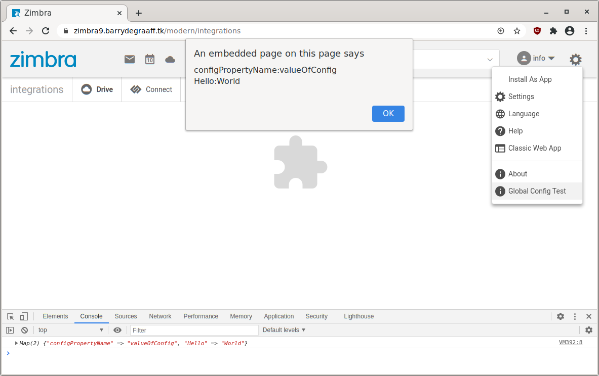

# Configuring Zimlets

Zimlets have the ability to use additional configuration properties. These allow you to write a Zimlet that can be configured by the administrator of the Zimbra server. This way you can avoid hard-coding client-id's, on premise service URL's, message templates etc.

## Adding config_template.xml to your Zimlet

The way this works is by using an XML configuration template that you must prepare when developing the Zimlet. To do so, add a file with the name `config_template.xml` to the root folder of your Zimlet. So it looks like this:

```
zimletfolder
├── build
├── config_template.xml
├── node_modules
├── package.json
├── package-lock.json
├── pkg
├── README.md
├── src
├── tsconfig.json
└── zimlet.config.js

```

The config_template.xml file has the following structure:

```xml
<zimletConfig name="zm-zimlet-configuration" version="0.0.1">
    <global>
        <property name="configPropertyName">valueOfConfig</property>
        <property name="Hello">World</property>
    </global>
</zimletConfig>

```

To include the config_template.xml in the Zimlet you must build and package it using Zimlet CLI. See https://github.com/Zimbra/zm-zimlet-guide. Example for this Zimlet:

      zimlet package -v 0.0.1 --zimbraXVersion ">=0.0.1" -n "zm-zimlet-configuration" --desc "zm-zimlet-configuration" -l "zm-zimlet-configuration"

The name and version of the Zimlet have been set so that they match between the Zimlet version and the configuration template version. This is usefull because the Administrator can extract the config_template.xml from the Zimlet. By putting the Zimlet version in the config_template.xml there is a way to keep track of what Zimlet version the configuration belongs to.

A pre packed version of the example Zimlet used in this article can be downloaded from 
https://github.com/Zimbra/zimbra-zimlet-configuration/releases/download/0.0.1/zm-zimlet-configuration.zip.

## Configuring Zimlets on Zimbra

Deploy the example Zimlet like so:

      wget https://github.com/Zimbra/zimbra-zimlet-configuration/releases/download/0.0.1/zm-zimlet-configuration.zip
      zmzimletctl deploy /tmp/zm-zimlet-configuration.zip

To make changes to the configuration one first gets the configuration template:

      zmzimletctl getConfigTemplate /tmp/zm-zimlet-configuration.zip > /tmp/myconfig.xml

Review and make changes to /tmp/myconfig.xml using vi or nano and deploy using:

      zmzimletctl configure  /tmp/myconfig.xml

Please note that it is not possible to side-load config_template.xml files. So you must always deploy an actual Zimlet to read the configuration properties.

## Using configuration properties in a Zimlet

This article assumes you have already set up your development environment, have basic understanding of Preact Zimlets and Zimlet CLI. If you are new to all this, please take a look at https://wiki.zimbra.com/wiki/DevelopersGuide#Zimlet_Development_Guide.

Log on to your Zimbra development server and make sure that you are seeing the modern UI. Go to the right top Gear menu and click the Global Config Test button. To display the loaded configuration properties.

> 
*Global Config Test button in Gear menu.*

## Global Config Test button in the Gear menu

The file src/components/more-menu/index.js implements the `Global Config Test` button in the Gear menu. The in-code comments explain how it works:

```javascript
import { createElement, Component } from 'preact';

export default class MoreMenu extends Component {
    constructor(props) {
        super(props);
        this.zimletContext = props.children.context;

        //Get all zimlets
        const zimlets = this.zimletContext.getAccount().zimlets
        this.globalConfig = new Map();
        //Get demo zimlet
        const zimlet = zimlets.zimlet.find(zimlet => zimlet.zimlet[0].name === "zm-zimlet-configuration");

        //Add all demo zimlet configuration properties to an ES6 Map
        if (zimlet) {
            const globalConfig = zimlet.zimletConfig[0].global[0].property || [];
            for (var i = 0; i < globalConfig.length; i++) {
                this.globalConfig.set(globalConfig[i].name, globalConfig[i].content);
            };
        }
        //https://developer.mozilla.org/en-US/docs/Web/JavaScript/Reference/Global_Objects/Map
        //now you can get a property value by doing: this.globalConfig.get('name-of-property')
    };

    //Show properties of this Zimlet in the browser developer console, and alert to the user.
    handleClick = e => {
        console.log(this.globalConfig);

        //Use forEach on ES6 Map to show it on screen for demo purpose.
        let globalConfigLogString = "";
        this.globalConfig.forEach(function (value, key, map) {
            globalConfigLogString += key + ":" + value + "\n";
        });

        alert(globalConfigLogString);
    }


    render() {
        return (
            <div onClick={this.handleClick} class="zimbra-client_menu-item_navItem zimbra-client_action-menu-item_item">
                <span class="zimbra-client_action-menu-item_icon">
                    <span role="img" class="zimbra-icon zimbra-icon-about blocks_icon_md"></span></span>
                <span class="zimbra-client_menu-item_inner">Global Config Test</span></div>
        );
    }
}

```

## References

- https://wiki.zimbra.com/wiki/Zimlet_Developers_Guide:Zimlet_Configuration_File_Reference
- https://wiki.zimbra.com/wiki/Zimlets,_Setting_Up
- https://github.com/Zimbra/zimlet-cli/wiki/Store-configurations-of-zimlet-using-Zimlet-Config
